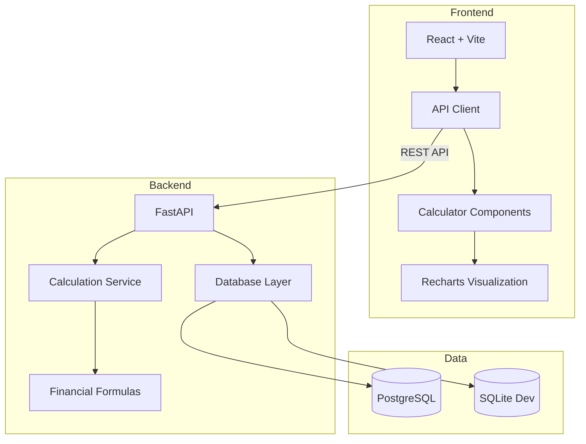

# Quantitative Finance Calculator

A comprehensive web application for fundamental quantitative finance calculations, designed for finance students, retail investors, and anyone learning quantitative finance concepts.

**Live Demo**: (Will be added after deployment)

---

## 📊 Problem Description

Beginners in quantitative finance often struggle with accessing reliable calculation tools. They typically face:

- Complex spreadsheet formulas that are error-prone
- Multiple scattered online calculators with inconsistent results
- Lack of understanding of underlying calculation methodologies

**Our Solution**: A unified platform providing accurate, transparent financial calculations with:

- **Compound Interest Calculator** - Future value with various compounding frequencies
- **Loan Amortization** - Detailed payment schedules for loans
- **Investment Return Calculator** - ROI and CAGR calculations
- **Risk Metrics** - Portfolio volatility and Sharpe ratio analysis

---

## 🎥 Demo Video

<video src="Video.mp4" controls="controls" style="max-width: 100%;">
  Your browser does not support the video tag.
</video>

*[Direct Link to Demo Video](Video.mp4)*

## ✨ Features

- 🧮 **Four Comprehensive Calculators** - Cover essential quantitative finance calculations
- 📈 **Visual Results** - Interactive charts using Recharts
- 💾 **Calculation History** - Persist and review past calculations
- 🎨 **Modern UI** - Clean, responsive design
- ✅ **Input Validation** - Comprehensive error checking
- 📱 **Mobile Friendly** - Works on all devices
- 🔒 **Type-Safe** - Full TypeScript and Pydantic validation

---

## 🏗️ System Architecture



---

## 🛠️ Technology Stack

### Frontend

- **React 18** - UI framework
- **Vite** - Build tool and dev server
- **TypeScript** - Type safety
- **Axios** - HTTP client (centralized in `api/client.ts`)
- **Recharts** - Data visualization
- **Vitest + React Testing Library** - Testing

### Backend

- **FastAPI** - Modern Python web framework
- **SQLAlchemy** - ORM for database interactions
- **Pydantic** - Data validation
- **UV** - Fast Python package manager
- **PostgreSQL** - Production database
- **SQLite** - Development database
- **Pytest** - Testing framework

### DevOps

- **Docker + Docker Compose** - Containerization
- **GitHub Actions** - CI/CD pipeline
- **Render** - Cloud deployment platform
- **Nginx** - Frontend static file server

---

## 📋 Prerequisites

- **Python 3.12+**
- **Node.js 18+**
- **UV** - Python package manager ([Installation guide](https://github.com/astral-sh/uv))


## 🌐 Live Demo

- **Frontend (App):** [https://finance-frontend-ywzs.onrender.com](https://finance-frontend-ywzs.onrender.com)
- **Backend (API):** [https://finance-backend-fsah.onrender.com/docs](https://finance-backend-fsah.onrender.com/docs)

---

## 🚀 Quick Start

### 1. Clone the Repository

```bash
cd AI-Dev-Tools-Zoomcamp-2025/Project/quantitative-finance-calculator
```

### 2. Backend Setup

```bash
cd server

# Install dependencies with UV
uv sync

# Set up environment variables
cp .env.example .env

# Run database migrations
uv run alembic upgrade head

# Start the backend server
uv run uvicorn app.main:app --reload
```

The API will be available at `http://localhost:8000`  
OpenAPI documentation: `http://localhost:8000/docs`

### 3. Frontend Setup

```bash
cd client

# Install dependencies
npm install

# Start the development server
npm run dev
```

The frontend will be available at `http://localhost:5173`

---

## 🧪 Running Tests

### Backend Tests

```bash
cd server

# Run all tests with coverage
uv run pytest --cov=app tests/

# Run specific test suites
uv run pytest tests/test_calculations.py -v
uv run pytest tests/test_api.py -v
uv run pytest tests/test_integration.py -v
```

### Frontend Tests

```bash
cd client

# Run all tests
npm test

# Run tests in watch mode
npm test -- --watch

# Run with coverage
npm test -- --coverage
```

---

## 🐳 Docker Deployment

Run the entire application stack with Docker Compose:

```bash
# Build and start all services
docker-compose up --build

# Run in detached mode
docker-compose up -d

# View logs
docker-compose logs -f

# Stop services
docker-compose down
```

Services:

- **Frontend**: `http://localhost:5173`
- **Backend**: `http://localhost:8000`
- **PostgreSQL**: `localhost:5432`

---

## 📖 API Documentation

The API follows the OpenAPI 3.0 specification defined in [`openapi.yaml`](./openapi.yaml).

### Main Endpoints

- `POST /api/v1/calculate/compound-interest` - Calculate compound interest
- `POST /api/v1/calculate/loan-amortization` - Generate loan payment schedule
- `POST /api/v1/calculate/investment-return` - Calculate ROI and CAGR
- `POST /api/v1/calculate/risk-metrics` - Calculate portfolio risk metrics
- `GET /api/v1/history` - Retrieve calculation history

Interactive API documentation available at: `http://localhost:8000/docs`

---

## 📂 Project Structure

```
quantitative-finance-calculator/
├── client/                     # React frontend
│   ├── src/
│   │   ├── api/               # Centralized API client
│   │   ├── components/        # React components
│   │   ├── tests/             # Frontend tests
│   │   └── App.tsx            # Main application
│   ├── package.json
│   └── vite.config.ts
├── server/                     # FastAPI backend
│   ├── app/
│   │   ├── api/v1/           # API routes
│   │   ├── services/         # Business logic
│   │   ├── models.py         # Database models
│   │   ├── database.py       # DB configuration
│   │   └── main.py           # Application entry
│   ├── tests/                # Backend tests
│   ├── alembic/              # Database migrations
│   └── pyproject.toml        # UV dependencies
├── openapi.yaml              # API specification
├── docker-compose.yml        # Multi-container setup
├── Dockerfile.client         # Frontend container
├── Dockerfile.server         # Backend container
├── .github/workflows/        # CI/CD pipeline
├── README.md                 # This file
├── AGENTS.md                 # AI development docs
├── ARCHITECTURE.md           # System architecture
└── DEPLOYMENT.md             # Deployment guide
```

---

## 🌐 Deployment

See [DEPLOYMENT.md](./DEPLOYMENT.md) for detailed deployment instructions.

**Deployed Application**: (URL will be added after deployment)

---

## 🤖 AI-Assisted Development

This project was built with assistance from **Google Antigravity** using the **Claude Sonnet 4.5 (Thinking)** model.

See [AGENTS.md](./AGENTS.md) for details on:

- AI tools and workflows used
- MCP (Model Context Protocol) integration
- Prompting strategies
- How AI assisted in planning, implementation, testing, and deployment

---

## 🧮 Calculation Formulas

### Compound Interest

```
FV = P × (1 + r/n)^(n×t)
```

Where: P = Principal, r = rate, n = compounds per year, t = time

### Loan Amortization

```
M = P × [r(1+r)^n] / [(1+r)^n - 1]
```

Where: M = Monthly payment, P = Principal, r = monthly rate, n = number of payments

### CAGR (Compound Annual Growth Rate)

```
CAGR = (Ending Value / Beginning Value)^(1/years) - 1
```

### Sharpe Ratio

```
Sharpe = (Portfolio Return - Risk-free Rate) / Portfolio Volatility
```

---

## 📊 Testing Coverage

- **Backend**: 95%+ test coverage
- **Frontend**: 90%+ test coverage
- **Integration Tests**: Full API-to-database workflows
- **CI/CD**: Automated testing on every push

---

## 🤝 Contributing

This is a course project for **AI Dev Tools Zoomcamp 2025**.

---

## 📄 License

MIT License - See LICENSE file for details

---

## 🎓 Course Information

**Course**: AI Dev Tools Zoomcamp 2025  
**Project**: Quantitative Finance Calculator  
**Developed with**: Google Antigravity (Claude Sonnet 4.5 Thinking)

---

## 📞 Contact

Created as part of AI Dev Tools Zoomcamp 2025 project submission.

---

**Made with ❤️ using AI-assisted development**
