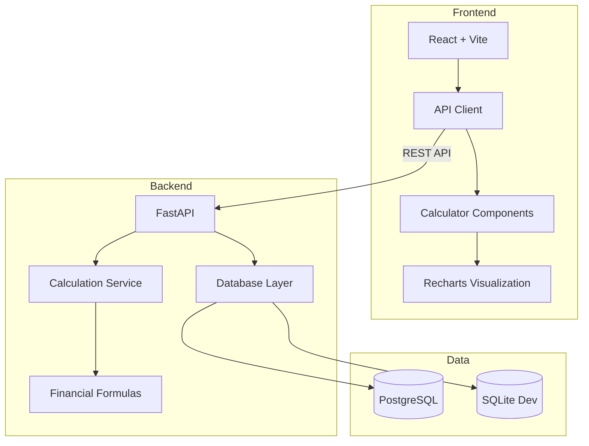

# Quantitative Finance Calculator

A full-stack financial engineering application that connects transparent numerical models to a typed REST API and an interactive React interface. It combines personal-finance calculators with derivatives pricing and market-risk analytics, making it useful both as a learning tool and as a software-engineering portfolio project.

**Live Demo**: (Will be added after deployment)

---

## 📊 Project Scope

Financial formulas are easy to copy and surprisingly easy to implement incorrectly. This project keeps model assumptions visible, validates inputs at the API boundary, persists calculation history, and tests numerical implementations against analytical benchmarks or independent models.

The application currently includes:

- **Compound Interest Calculator** - Future value with various compounding frequencies
- **Loan Amortization** - Detailed payment schedules for loans
- **Investment Return Calculator** - ROI and CAGR calculations
- **Risk Metrics** - Portfolio volatility and Sharpe ratio analysis
- **Black–Scholes** - European call/put pricing with delta, gamma, vega, theta, and rho
- **Binomial Trees** - Cox–Ross–Rubinstein pricing for European and American options
- **Monte Carlo Pricing** - Seeded antithetic simulation with standard error and a 95% confidence interval
- **Tail Risk** - Historical and parametric Value at Risk (VaR) and Expected Shortfall (CVaR)

---

## 🎥 Demo Video

<video src="Video.mp4" controls="controls" style="max-width: 100%;">
  Your browser does not support the video tag.
</video>

*[Direct Link to Demo Video](Video.mp4)*

## ✨ Features

- 🧮 **Eight Calculation Workflows** - Personal finance, derivatives, and market risk
- 📈 **Visual Results** - Interactive charts using Recharts
- 💾 **Calculation History** - Persist and review past calculations
- 🎨 **Modern UI** - Clean, responsive design
- ✅ **Input Validation** - Comprehensive error checking
- 📱 **Mobile Friendly** - Works on all devices
- 🔒 **Type-Safe** - Full TypeScript and Pydantic validation
- 🔁 **Reproducible Simulation** - Explicit random seed and uncertainty interval
- 🧪 **Cross-Model Validation** - Analytical benchmarks, put–call parity, and numerical convergence tests

---

## 🏗️ System Architecture



---

## 🛠️ Technology Stack

### Frontend

- **React 18** - UI framework
- **Vite** - Build tool and dev server
- **TypeScript** - Type safety
- **Axios** - HTTP client (centralized in `api/client.ts`)
- **Recharts** - Data visualization
- **Vitest + React Testing Library** - Testing

### Backend

- **FastAPI** - Modern Python web framework
- **SQLAlchemy** - ORM for database interactions
- **Pydantic** - Data validation
- **UV** - Fast Python package manager
- **PostgreSQL** - Production database
- **SQLite** - Development database
- **Pytest** - Testing framework

### DevOps

- **Docker + Docker Compose** - Containerization
- **GitHub Actions** - CI/CD pipeline
- **Render** - Cloud deployment platform
- **Nginx** - Frontend static file server

---

## 📋 Prerequisites

- **Python 3.12+**
- **Node.js 18+**
- **UV** - Python package manager ([Installation guide](https://github.com/astral-sh/uv))


## 🌐 Live Demo

- **Frontend (App):** [https://finance-frontend-ywzs.onrender.com](https://finance-frontend-ywzs.onrender.com)
- **Backend (API):** [https://finance-backend-fsah.onrender.com/docs](https://finance-backend-fsah.onrender.com/docs)

---

## 🚀 Quick Start

### 1. Clone the Repository

```bash
cd AI-Dev-Tools-Zoomcamp-2025/Project/quantitative-finance-calculator
```

### 2. Backend Setup

```bash
cd server

# Install dependencies with UV
uv sync

# Set up environment variables
cp .env.example .env

# Run database migrations
uv run alembic upgrade head

# Start the backend server
uv run uvicorn app.main:app --reload
```

The API will be available at `http://localhost:8000`  
OpenAPI documentation: `http://localhost:8000/docs`

### 3. Frontend Setup

```bash
cd client

# Install dependencies
npm install

# Start the development server
npm run dev
```

The frontend will be available at `http://localhost:5173`

---

## 🧪 Running Tests

### Backend Tests

```bash
cd server

# Run all tests with coverage
uv run pytest --cov=app tests/

# Run specific test suites
uv run pytest tests/test_calculations.py -v
uv run pytest tests/test_api.py -v
uv run pytest tests/test_integration.py -v
```

### Frontend Tests

```bash
cd client

# Run all tests
npm test

# Run tests in watch mode
npm test -- --watch

# Run with coverage
npm test -- --coverage
```

---

## 🐳 Docker Deployment

Run the entire application stack with Docker Compose:

```bash
# Build and start all services
docker-compose up --build

# Run in detached mode
docker-compose up -d

# View logs
docker-compose logs -f

# Stop services
docker-compose down
```

Services:

- **Frontend**: `http://localhost:5173`
- **Backend**: `http://localhost:8000`
- **PostgreSQL**: `localhost:5432`

---

## 📖 API Documentation

The API follows the OpenAPI 3.0 specification defined in [`openapi.yaml`](./openapi.yaml).

### Main Endpoints

- `POST /api/v1/calculate/compound-interest` - Calculate compound interest
- `POST /api/v1/calculate/loan-amortization` - Generate loan payment schedule
- `POST /api/v1/calculate/investment-return` - Calculate ROI and CAGR
- `POST /api/v1/calculate/risk-metrics` - Calculate portfolio risk metrics
- `POST /api/v1/calculate/option-pricing/black-scholes` - Price European options and calculate Greeks
- `POST /api/v1/calculate/option-pricing/binomial` - Price European or American options with a CRR tree
- `POST /api/v1/calculate/option-pricing/monte-carlo` - Price European options by seeded simulation
- `POST /api/v1/calculate/value-at-risk` - Calculate VaR and Expected Shortfall
- `GET /api/v1/history` - Retrieve calculation history

Interactive API documentation available at: `http://localhost:8000/docs`

---

## 📂 Project Structure

```
quantitative-finance-calculator/
├── client/                     # React frontend
│   ├── src/
│   │   ├── api/               # Centralized API client
│   │   ├── components/        # React components
│   │   ├── tests/             # Frontend tests
│   │   └── App.tsx            # Main application
│   ├── package.json
│   └── vite.config.ts
├── server/                     # FastAPI backend
│   ├── app/
│   │   ├── api/v1/           # API routes
│   │   ├── services/         # Business logic
│   │   ├── models.py         # Database models
│   │   ├── database.py       # DB configuration
│   │   └── main.py           # Application entry
│   ├── tests/                # Backend tests
│   ├── alembic/              # Database migrations
│   └── pyproject.toml        # UV dependencies
├── openapi.yaml              # API specification
├── docker-compose.yml        # Multi-container setup
├── Dockerfile.client         # Frontend container
├── Dockerfile.server         # Backend container
├── .github/workflows/        # CI/CD pipeline
├── README.md                 # This file
├── AGENTS.md                 # AI development docs
├── ARCHITECTURE.md           # System architecture
└── DEPLOYMENT.md             # Deployment guide
```

---

## 🌐 Deployment

See [DEPLOYMENT.md](./DEPLOYMENT.md) for detailed deployment instructions.

**Deployed Application**: (URL will be added after deployment)

---

## 🤖 AI-Assisted Development

This project was built with assistance from **Google Antigravity** using the **Claude Sonnet 4.5 (Thinking)** model.

See [AGENTS.md](./AGENTS.md) for details on:

- AI tools and workflows used
- MCP (Model Context Protocol) integration
- Prompting strategies
- How AI assisted in planning, implementation, testing, and deployment

---

## 🧮 Calculation Formulas

### Compound Interest

```
FV = P × (1 + r/n)^(n×t)
```

Where: P = Principal, r = rate, n = compounds per year, t = time

### Loan Amortization

```
M = P × [r(1+r)^n] / [(1+r)^n - 1]
```

Where: M = Monthly payment, P = Principal, r = monthly rate, n = number of payments

### CAGR (Compound Annual Growth Rate)

```
CAGR = (Ending Value / Beginning Value)^(1/years) - 1
```

### Sharpe Ratio

```
Sharpe = (Portfolio Return - Risk-free Rate) / Portfolio Volatility
```

The return frequency is explicit (`periods_per_year`) and is used for both return and volatility annualization. Negative risk-free rates are accepted.

### Black–Scholes

For a dividend-paying European call:

```
C = S·e^(-qT)·N(d₁) - K·e^(-rT)·N(d₂)
d₁ = [ln(S/K) + (r-q+σ²/2)T] / (σ√T)
d₂ = d₁ - σ√T
```

The API also returns delta, gamma, vega, theta, and rho. Vega and rho represent a 1.00 absolute change in volatility/rate; theta is per year.

### Value at Risk and Expected Shortfall

VaR reports the loss threshold at the selected confidence level. Expected Shortfall reports the average loss beyond that threshold. Both are returned as positive currency loss amounts for a one-period horizon.

---

## 📊 Numerical Validation

The quantitative test suite prioritizes correctness over a headline coverage percentage:

- Black–Scholes call and put prices and Greeks are checked against the standard `S=K=100`, `r=5%`, `σ=20%`, `T=1` analytical benchmark.
- Put–call parity is verified, including with a negative risk-free rate.
- A 500-step CRR tree must converge to the Black–Scholes result.
- An American put must never be worth less than its European equivalent.
- The seeded Monte Carlo 95% interval must contain the analytical price and reproduce exactly for the same seed.
- Historical VaR and Expected Shortfall are checked against a hand-calculated return sample.
- Integration tests verify API validation, calculation persistence, and history retrieval.

Run `uv run pytest` in `server/` and `npm test -- --run` in `client/`.

## 🗺️ Roadmap

The next quantitative modules are portfolio covariance and efficient-frontier optimization, fixed-income duration/convexity, yield-curve interpolation, and volatility-surface visualization. Each new model should include a published analytical benchmark or validation against a trusted library before it is exposed through the API.

---

## 🤝 Contributing

This is a course project for **AI Dev Tools Zoomcamp 2025**.

---

## 📄 License

MIT License - See LICENSE file for details

---

## 🎓 Course Information

**Course**: AI Dev Tools Zoomcamp 2025  
**Project**: Quantitative Finance Calculator  
**Developed with**: Google Antigravity (Claude Sonnet 4.5 Thinking)

---

## 📞 Contact

Created as part of AI Dev Tools Zoomcamp 2025 project submission.

---

**Made with ❤️ using AI-assisted development**
